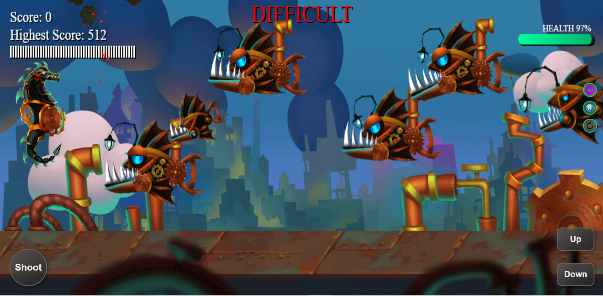

# 🌊 SimSea

**SimSea** is a 2D underwater action shooter built with **vanilla JavaScript** and packaged into an Android APK.

Dive into the ocean, fight dangerous sea creatures, collect power-ups, and survive increasingly intense waves.

---

## 📱 Download Android APK

👉 **Latest Release:**
https://github.com/Muhammad-Zubair796/SimSea/releases/latest

Install on your Android device and play.

---

## 🎮 Features

* Smooth canvas-based rendering
* Multiple enemy types
* Projectile combat system
* Particle explosions & effects
* Level progression
* Health system (Difficult mode)
* Power-ups & EXTREME mode
* Sound effects & controls
* Mobile + keyboard support

---

## 🕹 Controls

### Desktop

* **↑ / ↓** → Move
* **Space** → Shoot

### Mobile

* On-screen buttons for movement and shooting

---

## ⚡ Game Modes

### Normal Mode

* Score targets to progress
* Timed stages

### Difficult Mode

* Player health system
* Faster enemies
* Suicide attackers
* Higher challenge

---

## 📸 Screenshot

---

## 🛠 Tech Stack

* Vanilla JavaScript
* HTML5 Canvas
* Android WebView packaging

---

## 🚀 Future Plans

* Play Store release
* Boss battles
* Save system
* Menu animations
* More enemies & maps

---

## 👨‍💻 Author

**Muhammad Zubair**

If you like the project, consider starring ⭐ the repo.

---

## 📜 License

Open source for learning and experimentation.
